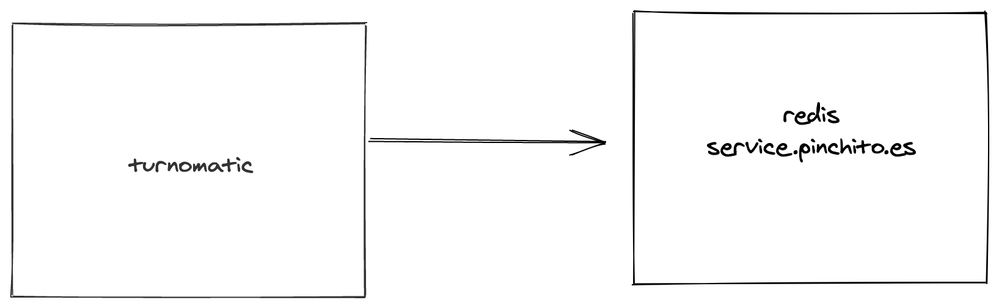
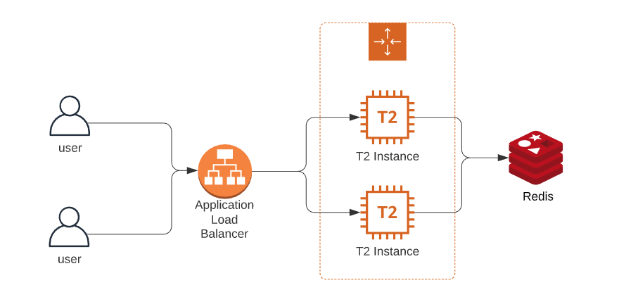
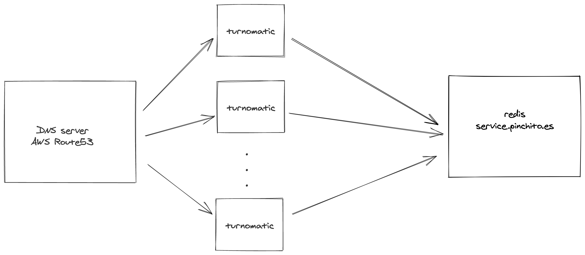

# Arquitectura
Hemos probado tres configuraciones apuntando a un redis en servidor externo: servidor independiente, servidor en clúster con un balanceador de carga de AWS, servidor en clúster con balanceo de carga por DNS.

## Servidor independiente

Disponemos de una instancia de tipo t2.small (1 vCPU y 2 GB RAM) y conectamos con un redis centralizado en el servidor "service.pinchito.es"

## Servidor en clúster con un balanceador de carga de AWS

Disponemos de varias instancias de tipo t2.small (1 vCPU y 2 GB RAM) tras un balanceador de carga de AWS, conectamos con un redis centralizado en el servidor "service.pinchito.es"

## Servidor en clúster con balanceo de carga por DNS

Disponemos de varias instancias de tipo t2.small (1 vCPU y 2 GB RAM) tras un servidor de DNS como podría ser Route53 de AWS, conectamos con un redis centralizado en el servidor "service.pinchito.es"

