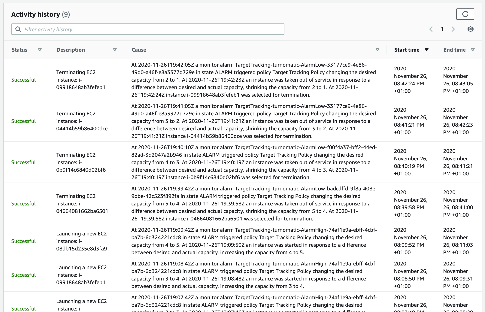

# Balanceo

Hemos probado dos sistemas de balanceo: un balanceador de carga de AWS y balanceo por DNS.

Como ya hemos comentado el balanceador de carga de AWS tiene un límite de peticiones por segundo, pues al final es una máquina que tiene sus propios límites. Además parece ser que AWS limita a unas 14k ó 15k peticiones por segundo a priori.

El balanceo por DNS parece no tener otro límite que el número de direcciones IP que puede manejar el servidor DNS.

Otra opción podría ser usar Nginx como proxy inverso, según [algunos artículos de internet](https://pinchito.es/2016/nginx-balancer) parece que podría soportar cerca de 1 millón de peticiones por segundo.

Hemos implementado un autoescalado basado en el consumo de CPU. Para probarlo hemos puesto las dos instancias iniciales a consumir mucha CPU con el programa `stress` y hemos visto cómo se añadían tres instancias más. Cuando hemos para el programa `stress` el número de instancias ha bajado a 1, que es el mínimo configurado.

