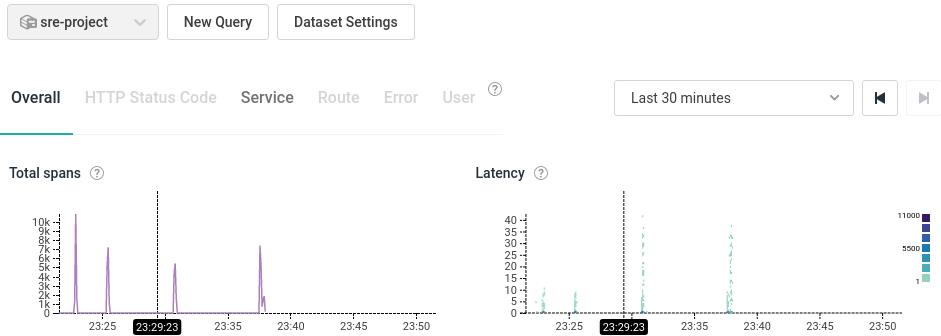
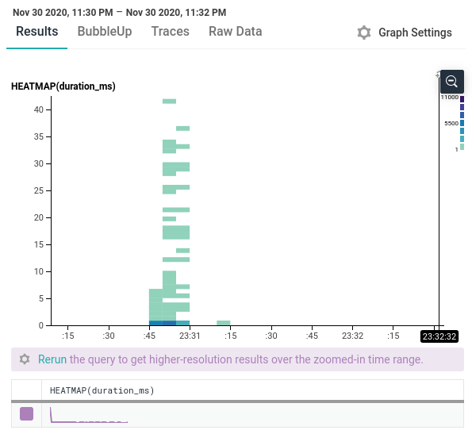
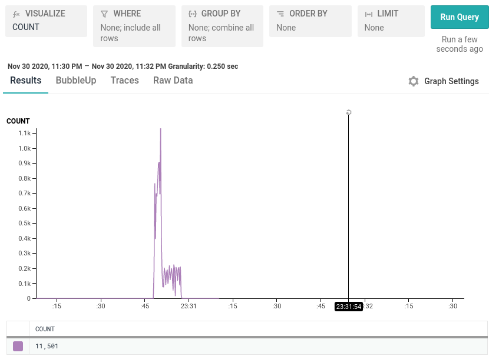
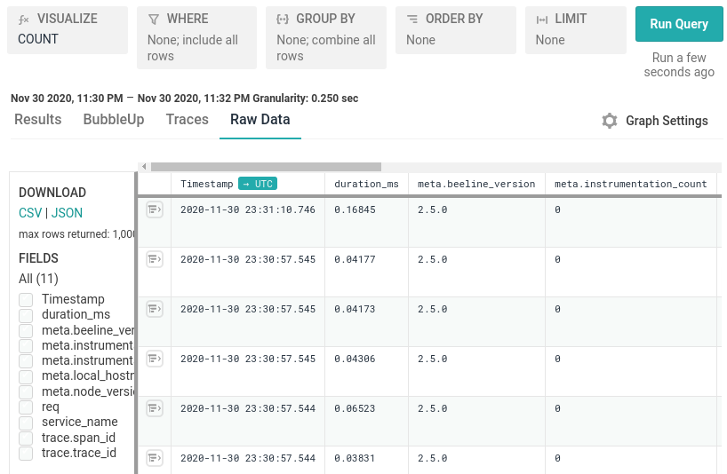
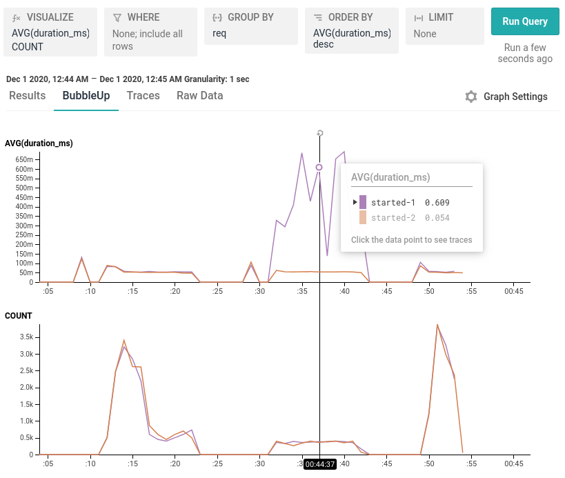

# Instrumenting with Honeycomb.io

This explains an initial attempt of instrumenting with Honeycomb.io.

Here are the steps done to try it over our current architecture:

1. Install `honeycomb-beeline` npm module,
1. Add dependency in `server-remote.js`
    ```shell
    const beeline = require('honeycomb-beeline')({
      writeKey: '***',
      dataset: 'sre-project',
      serviceName: 'counter'
    });
    ```
1. Add some traces in the `server-remote.js` HTTP handler, e.g.
    ```shell
    let trace = beeline.startTrace({request: 'started'});
    //...
    beeline.finishTrace(trace);
    ```
1. Run the server in one shell,
1. Perform some requests in different CPU conditions.

The POC succeeded and some logs where recorded in Honeycomb.io board; see a [performance test with Honeycomb.io](#performance-test-with-honeycomb) and some screenshots below:






## Performance Test With Honeycomb

With this setup, we could view how behave the cluster of 2 servers beyond a ELB when the first's one CPU was quite demanded (using `stress`).



In the linechart above, the first server's CPU (in purple) is quite demanded between `:30` and `:45`, so it has more latency in this period while attending the very same requests than the second server (in rose).
