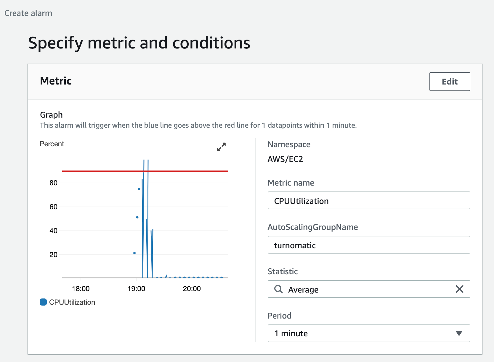
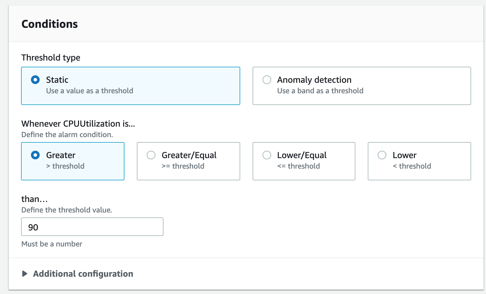

# Monitorización

Hemos elegido CloudWatch para monitorizar el sistema.

Hemos creado una alerta usando la monitorización del grupo de autoescalado para alertar de un consumo excesivo de CPU.

No hemos sabido configurar una alerta de exceso de respuestas con errores porque la arquitectura por la que hemos optado finalmente es balanceo por DNS. No sabemos crear una alerta desde la consola de AWS de exceso de errores si no es usando un balanceador de carga.
